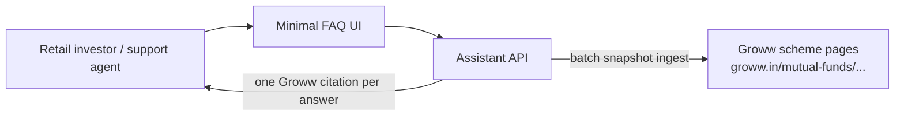
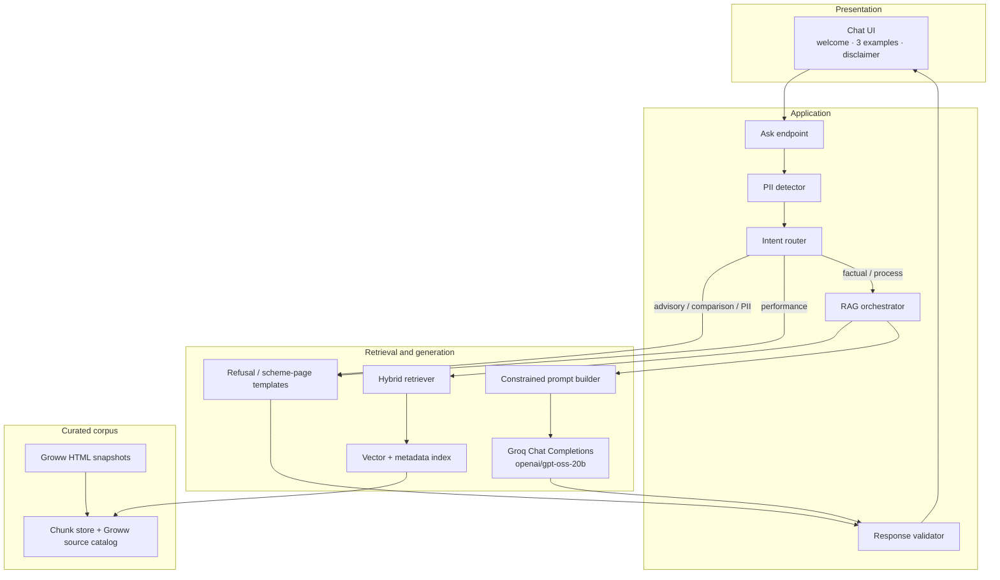
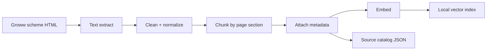
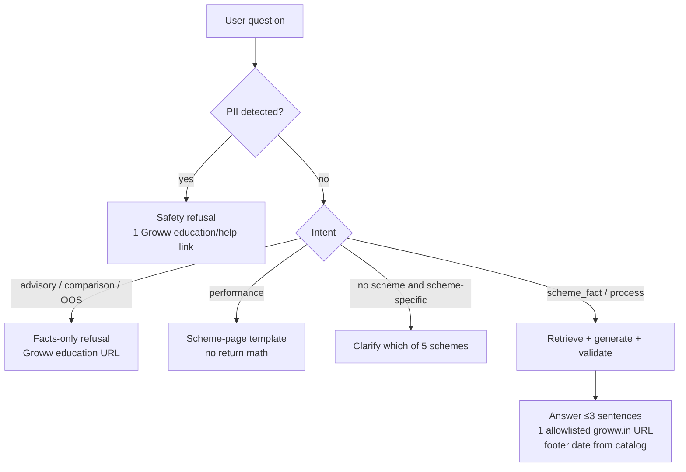
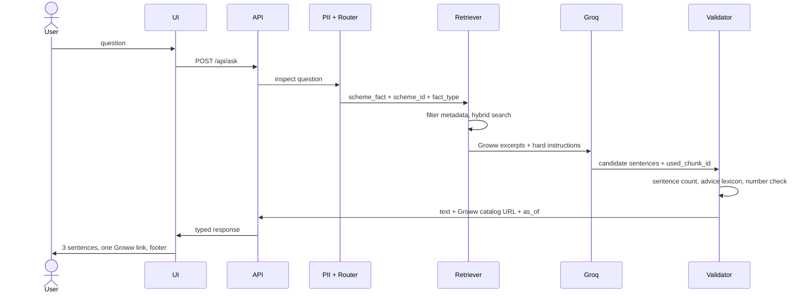

# Architecture: Mutual Fund FAQ Assistant

This document defines the system architecture for the facts-only Mutual Fund FAQ Assistant described in [`docs/problemStatement.md`](./problemStatement.md). It is the design source of truth for implementation.

**Design north star:** accuracy over intelligence. Retrieve from the curated **Groww** scheme pages, generate short verifiable answers, refuse advice.

**Corpus decision:** the source model is the **Groww URLs listed in the problem statement**, not HDFC AMC, AMFI, SEBI, or other sites. Citations must be those Groww URLs (or other catalogued `groww.in` pages for education/process). Do not ingest or cite AMC PDFs, AMFI, SEBI, Value Research, Morningstar, or blogs.

---

## 1. Goals and non-goals

### 1.1 Goals

- Answer factual queries about **five HDFC Mutual Fund schemes** from a curated **Groww** corpus
- Use a **lightweight RAG** pipeline: ingest → retrieve → generate (Groq) → cite
- Enforce **facts-only** behaviour with deterministic guardrails, not prompt hope
- Return answers in a **fixed contract**: ≤ 3 sentences, **exactly one** Groww citation, footer `Last updated from sources: <date>`
- Ship a **minimal UI**: welcome message, three example questions, visible disclaimer

### 1.2 Non-goals

- Investment advice, suitability, rankings, or “which fund is better”
- Performance / return calculation or comparison
- Multi-AMC coverage, live market data, or scraping non-Groww aggregators (Value Research, Morningstar, blogs)
- Live crawl of Groww at question time (ingest is a batch snapshot of the catalogued URLs)
- User accounts, KYC, PAN/Aadhaar, email, phone, OTPs, or any PII storage
- Long-form education; answers stay within three sentences

---

## 2. System context



**Product context vs data context**

| Role | Systems | Allowed? |
| --- | --- | --- |
| UX reference | Groww FAQ / scheme-page patterns | Yes |
| Fact sources | The five Groww scheme URLs in §5.4 (plus catalogued `groww.in` education/process pages) | Yes — only allowed retrieval/citation sources |
| Other sites | HDFC AMC, AMFI, SEBI, Value Research, Morningstar, blogs | No — do not ingest or cite |

---

## 3. High-level architecture

The system is a **single-process, local-first RAG app** with a thin HTTP/UI layer. There is no user database.



### 3.1 Layers

| Layer | Responsibility |
| --- | --- |
| Presentation | Minimal chat; never persist user text beyond the in-memory request |
| Guardrails | PII block, intent classification, lexical advice filters |
| Orchestration | Choose path (answer / refuse / factsheet-only), assemble final payload |
| Retrieval | Scheme-aware hybrid search over Groww chunks only |
| Generation | Groq Chat Completions (constrained JSON) or template; no free-form essays |
| Validation | Hard-fail if sentence count, citation, or footer rules break |
| Corpus | Offline Groww HTML snapshots + source catalog with `as_of` dates |

---

## 4. Runtime components

### 4.1 Ask API

**Endpoint:** `POST /api/ask`

**Request**

```json
{
  "question": "What is the expense ratio of HDFC Large Cap Fund Direct Growth?"
}
```

**Response** (always the same shape)

```json
{
  "type": "answer | refuse | factsheet_only | error",
  "text": "At most three sentences...",
  "citation_url": "https://groww.in/mutual-funds/hdfc-large-cap-fund-direct-growth",
  "citation_label": "Groww — HDFC Large Cap Fund Direct Growth",
  "last_updated_from_sources": "2026-08-01",
  "disclaimer": "Facts-only. No investment advice."
}
```

The UI renders `text`, then the citation as a single Groww link, then:

```
Last updated from sources: 2026-08-01
```

No session IDs, cookies, or user identifiers are required or stored.

### 4.2 PII detector

Runs **before** retrieval and logging.

| Detect | Action |
| --- | --- |
| PAN, Aadhaar, account-like numbers, OTP patterns, emails, phone numbers | **Do not** retrieve, generate, log, or store the raw question. Return a refusal: this assistant does not accept personal or account data. Cite one catalogued Groww education/help URL. |

Implementation: regex + simple validators (PAN/Aadhaar checksum optional). Keep it local and deterministic.

### 4.3 Intent router

Classifies each question into one path. Prefer a **small rules + keyword** classifier first (reliable, cheap, no model drift). Optionally add a Groq second-pass classifier only when rules are uncertain — still no web tools.

| Intent | Signals (examples) | Path |
| --- | --- | --- |
| `advisory` | should I, shall I, recommend, buy, sell, suitable, risk appetite, better for me | Refusal template + Groww education URL |
| `comparison` | which is better, vs, versus, best fund, rank, outperform | Refusal template + Groww education URL |
| `performance` | returns, CAGR, 1Y/3Y/5Y, NAV history, how much did it give | Scheme-page-only template (no numbers computed); cite that scheme’s Groww URL |
| `process` | download statement, capital gains report, CAS, folio | Retrieve from catalogued Groww help/process pages |
| `scheme_fact` | expense ratio, TER, exit load, SIP, lock-in, riskometer, benchmark | Scheme-scoped RAG over that scheme’s Groww page |
| `out_of_scope` | other AMCs, stocks, crypto, tax filing, personal portfolio | Refusal + Groww education URL |
| `pii` | already handled by PII detector | Safety refusal |

Router must be **conservative**: if the question mixes facts with advice (“what is the TER and should I buy?”), treat as `advisory`.

### 4.4 RAG orchestrator

For `scheme_fact` and `process`:

1. Resolve **scheme** (see §6)
2. Retrieve top-k chunks with metadata filters
3. If retrieval confidence is below threshold → honest “not in corpus” reply with the closest Groww scheme URL (still one citation)
4. Build a constrained prompt with retrieved passages only
5. Call **Groq** Chat Completions (no tools, no web search)
6. Validate and repair (see §4.5)

The orchestrator never gives the model unaugmented web access. Do **not** use Groq Compound (`groq/compound`, `groq/compound-mini`): those systems can search the web and would pull non-Groww pages. Grounding is **only** the retrieved Groww chunks. Never send a PII-flagged question to Groq.

### 4.5 Response validator (hard gate)

Reject or repair the model output until it satisfies:

| Rule | Check |
| --- | --- |
| Length | ≤ 3 sentences (split on `.?!` with abbreviation handling for “e.g.”, “SEBI”) |
| Citation | Exactly one `https://` URL, and it **must** be in the **allowlist** of Groww URLs from the source catalog |
| Footer date | ISO date present; taken from chunk metadata `as_of`, not from the model |
| Advice lexicon | Fail if output contains recommend, should invest, better than, buy, sell, outperform, guaranteed, etc. |
| Numbers | Any numeric claim must appear in retrieved text (simple entailment: number string match) |
| Performance | If intent was `performance`, body must not contain computed return percentages |

If repair fails twice, fall back to a **template answer** that quotes a retrieved sentence or, if empty, a “not found — see the Groww scheme page” template. **Never** ship an uncited model guess.

---

## 5. RAG design

### 5.1 Why this RAG is lightweight

| Choice | Rationale |
| --- | --- |
| Five schemes, one AMC, one host | Corpus is five Groww HTML pages; no hosted vector DB |
| Curated ingest, not query-time crawl | Source quality and allowlist are explicit |
| Hybrid retrieve + metadata filters | Scheme mix-ups are the main accuracy risk |
| Top-k = 3–5 | Answers are three sentences; extra context causes hallucination |
| Single citation | Almost always that scheme’s Groww URL |
| Offline index | Reproducible snapshots of the catalogued Groww URLs |

### 5.2 Corpus and source model

The **only** retrieval and citation host is `groww.in`.

**Canonical scheme pages** (from the problem statement — these *are* the corpus, not identity-only references):

| `scheme_id` | Scheme | Category | Source URL |
| --- | --- | --- | --- |
| `hdfc-mid-cap-direct-growth` | HDFC Mid Cap Fund — Direct Growth | Mid-cap | https://groww.in/mutual-funds/hdfc-mid-cap-fund-direct-growth |
| `hdfc-small-cap-direct-growth` | HDFC Small Cap Fund — Direct Growth | Small-cap | https://groww.in/mutual-funds/hdfc-small-cap-fund-direct-growth |
| `hdfc-gold-etf-fof-direct-growth` | HDFC Gold ETF Fund of Fund — Direct Plan Growth | Gold ETF FoF | https://groww.in/mutual-funds/hdfc-gold-etf-fund-of-fund-direct-plan-growth |
| `hdfc-large-cap-direct-growth` | HDFC Large Cap Fund — Direct Growth | Large-cap | https://groww.in/mutual-funds/hdfc-large-cap-fund-direct-growth |
| `hdfc-elss-tax-saver-direct-growth` | HDFC ELSS Tax Saver Fund — Direct Plan Growth | ELSS | https://groww.in/mutual-funds/hdfc-elss-tax-saver-fund-direct-plan-growth |

**Same-host extras (optional, still `groww.in` only)** for refusals and process FAQs, recorded in `sources.json` — for example Groww mutual-fund explainers and help pages for statements / capital-gains reports. Do **not** add `hdfcfund.com`, `amfiindia.com`, or `sebi.gov.in`.

Each scheme page is expected to cover, as published on Groww:

| Fact type | Where on the Groww page (typical) |
| --- | --- |
| Expense ratio / TER | Fund details / expense ratio |
| Exit load | Fund details / exit load |
| Minimum SIP | Investment / SIP minimum |
| ELSS lock-in | ELSS scheme details (ELSS page only) |
| Riskometer | Riskometer / risk label |
| Benchmark | Benchmark index |
| Returns display | Returns section — **do not calculate**; `performance` intent **links this page only** |

**ELSS-specific:** lock-in **must** be present on the ELSS Groww snapshot.

**Gold FoF-specific:** its own Groww URL; metadata filters prevent equity-scheme bleed.

### 5.3 Ingest pipeline



**Ingest steps**

1. **Acquire** HTML snapshots of the five URLs (and any catalogued Groww help/education pages) into `data/raw/`. Record `source_url`, `retrieved_on`, `as_of` (page “as of” / last-updated if shown; else snapshot date).
2. **Extract** text (HTML-to-text). Do not download AMC factsheet PDFs from other hosts.
3. **Clean** nav chrome, cookie banners, repeated marketing CTAs that drown retrieval. Keep factual sections.
4. **Chunk** by on-page section where possible (Expense Ratio, Exit Load, Min SIP, Riskometer, Benchmark, Lock-in), else ~400–800 tokens with 80-token overlap.
5. **Tag** each chunk with metadata (§5.4).
6. **Embed** with a local embedding model; store vectors + metadata together.
7. **Write** `data/catalog/sources.json` used by the citation allowlist and footer dates.

Re-ingest is a **batch CLI**, not a runtime crawl of Groww on each ask. Last-updated dates come from the catalog, not generation time. `python -m app.corpus.refresh` re-fetches every catalogued `groww.in` URL, verifies that no scheme lost a declared fact, and only then rewrites snapshots, catalog dates, and `chunks.jsonl`. A GitHub Actions workflow (`.github/workflows/refresh-corpus.yml`) runs that CLI daily; a failed verification commits nothing and leaves the last good corpus live.

### 5.4 Chunk metadata schema

```json
{
  "chunk_id": "hdfc-large-cap-direct-growth-groww-ter",
  "scheme_id": "hdfc-large-cap-direct-growth",
  "scheme_name": "HDFC Large Cap Fund - Direct Plan - Growth",
  "plan": "direct",
  "option": "growth",
  "category": "large-cap",
  "doc_type": "scheme_page | education | process",
  "fact_types": ["expense_ratio"],
  "source_url": "https://groww.in/mutual-funds/hdfc-large-cap-fund-direct-growth",
  "source_title": "Groww — HDFC Large Cap Fund Direct Growth",
  "as_of": "2026-08-20",
  "retrieved_on": "2026-08-20",
  "publisher": "groww",
  "text": "..."
}
```

`publisher` must be `groww`. `source_url` host must be `groww.in` and must appear in `sources.json`. Anything else is rejected at ingest time.

### 5.5 Retrieval strategy

**Hybrid, scheme-first:**

1. **Scheme resolver** maps the question to `scheme_id` (alias list: “HDFC large cap”, “HDFC Large Cap Fund Direct Growth”, etc.).
2. If a scheme is identified, **hard-filter** `scheme_id` (and `plan=direct` when the user said Direct).
3. If fact type is detected (expense ratio, exit load, …), **boost** chunks with matching `fact_types`.
4. **Dense** search (embeddings) + **sparse** search (BM25/keyword) over the filtered set; fuse with RRF (Reciprocal Rank Fusion).
5. Return **k = 4** chunks. Drop chunks below a similarity floor.
6. **Citation picker:** choose the single chunk that supports the answered fact. For scheme facts and performance-link, that is almost always the scheme’s Groww URL. For process, the catalogued Groww help URL. That `source_url` is the only citation.

**Process queries** (statements, capital gains): filter `doc_type = process` and `fact_types` includes `process`. Do not mix in scheme TER chunks.

**No scheme mentioned:** if the fact is scheme-specific, ask a **one-sentence clarification** listing the five in-scope schemes. That clarification is a system message, not a RAG generation, and still shows the disclaimer. Do not guess a scheme.

### 5.6 Generation (Groq)

**Provider:** Groq Cloud Chat Completions via the official `groq` Python SDK.  
**Auth:** `GROQ_API_KEY` in the environment (never committed).  
**Default model:** `openai/gpt-oss-20b` (fast, low cost, strict JSON Schema supported — a formatter, not a knowledge source).  
**Quality override:** `openai/gpt-oss-120b` via `GROQ_MODEL` if short answers need a stronger model.  
**Forbidden:** `groq/compound` and `groq/compound-mini` (built-in web search / tools).  
**Console limits (`openai/gpt-oss-120b`):** 30 requests/min, 1 000 requests/day, 8 000 tokens/min, 200 000 tokens/day. The client tracks these with sliding windows, waits at most 2s for a minute-window slot, then falls back to a verbatim Groww quote instead of bursting.

**Call settings**

| Parameter | Value | Why |
| --- | --- | --- |
| `temperature` | `0` | Deterministic facts-only wording |
| `max_completion_tokens` | `256` (enough for 3 sentences + JSON) | Hard cap against essays |
| `response_format` | JSON Schema / structured outputs | `{ sentences, used_chunk_id }` |
| Tools / browsing | Off | Groww snapshots are the only ground truth |
| Streaming | Off for v1 | Validator needs the full object |

Client sketch:

```python
import os
from groq import Groq

client = Groq()  # reads GROQ_API_KEY
completion = client.chat.completions.create(
    model=os.environ.get("GROQ_MODEL", "openai/gpt-oss-20b"),
    temperature=0,
    max_completion_tokens=256,
    response_format={"type": "json_object"},  # prefer json_schema when using gpt-oss
    messages=[...],
)
```

**System prompt rules (must be implemented as prompt + validator, not prompt alone):**

- Answer only from the provided Groww excerpts
- Maximum three sentences
- No advice, comparisons, rankings, or return calculations
- Do not invent numbers or dates
- Do not cite AMC, AMFI, SEBI, or other non-Groww sites
- If excerpts are insufficient, say the fact is not in the loaded Groww pages

**The model does not choose the citation URL or the footer date.** The orchestrator attaches those from chunk metadata after generation. This prevents hallucinated links.

**Structured generation (preferred):**

```json
{
  "sentences": ["...", "..."],
  "used_chunk_id": "hdfc-large-cap-direct-growth-groww-ter"
}
```

Then the API serializes to the public response shape.

On Groq timeout, 429, 5xx, or a local quota miss: do not retry unbounded; fall back to a verbatim quote from the top chunk if a fact can be copied, else `error` + that scheme’s Groww URL (see §12).

---

## 6. Query handling paths



### 6.1 Factual answer (happy path)

**Example:** “What is the expense ratio of HDFC Large Cap Fund Direct Growth?”

1. Intent `scheme_fact`, scheme `hdfc-large-cap-direct-growth`, fact `expense_ratio`
2. Retrieve TER chunk from that scheme’s Groww snapshot
3. Generate 1–2 sentences stating the TER **as on the Groww page**
4. Cite `https://groww.in/mutual-funds/hdfc-large-cap-fund-direct-growth` only
5. Footer = chunk `as_of`

### 6.2 Advisory refusal

**Example:** “Should I invest in HDFC Small Cap Fund?”

Do **not** retrieve scheme facts (that would look like a nudge). Return a fixed polite template:

- Decline to advise
- Restate facts-only limitation
- One Groww education URL from the catalog
- Footer = that education page’s `as_of`

### 6.3 Performance / returns

**Example:** “What returns did this fund give last year?”

- Do **not** compute or compare returns
- Template: this assistant does not calculate or compare performance; see the scheme page on Groww
- Citation = that scheme’s Groww URL (the page that displays returns)
- If scheme is missing, ask which scheme, then link that Groww page

### 6.4 Process

**Example:** “How do I download a capital gains report?”

- Retrieve catalogued Groww help/process text
- Three sentences max: where to go on Groww, no request for PAN/folio in the UI
- One Groww process-page citation
- If no Groww process page was catalogued, not-found + Groww mutual-funds hub URL — still `groww.in`, never AMC/registrar hosts

---

## 7. User interface

Minimal single-page chat. Groww is both **UX reference** (simple, calm, question-first) and **data source**.

**Required elements**

1. **Welcome message** — what the assistant is and is not
2. **Three example questions** (click-to-fill), aligned with in-scope facts, e.g.:
   - What is the expense ratio of HDFC Large Cap Fund Direct Growth?
   - What is the exit load on HDFC Mid Cap Fund Direct Growth?
   - What is the lock-in period for HDFC ELSS Tax Saver Fund Direct Plan Growth?
3. **Visible disclaimer** at all times: `Facts-only. No investment advice.`
4. Answer area: body, **one** Groww source link, last-updated footer

**Must not include**

- Sign-in, profile, PAN/folio fields, file uploads of statements
- Charts of returns, comparison tables, “invest now” CTAs
- Suggested follow-ups that are advisory (“Want a recommendation?”)

**State:** React/local component state or Streamlit session for the current thread only. Clearing the tab drops history. Do not write questions to disk.

---

## 8. Implementation stack

Chosen to stay **lightweight**, local, and easy to document in the README. Retrieval stays local; **generation is Groq only**.

| Concern | Choice | Why |
| --- | --- | --- |
| Language | Python 3.11+ | Fast RAG prototyping, HTML extract |
| UI | Streamlit **or** a small FastAPI + static HTML page | Minimal UI requirement; Streamlit is fastest |
| API | FastAPI `POST /api/ask` if UI is decoupled | Clear contract for tests |
| Orchestration | Plain Python modules (no heavy agent framework required) | Deterministic guardrails matter more than tool-calling agents |
| Embeddings | Local `sentence-transformers` (e.g. `all-MiniLM-L6-v2`) | Small corpus; queries are not sent to Groq for embedding |
| Vector index | Chroma **or** FAISS persisted under `data/index/` | No hosted DB |
| Sparse search | BM25 (`rank-bm25`) | Exact terms: “exit load”, “TER”, scheme names |
| LLM | **Groq** Chat Completions, `openai/gpt-oss-20b` (override: `openai/gpt-oss-120b`) | Fast constrained generation; temperature 0; JSON object/schema |
| Groq SDK | `groq` Python package | Official client; reads `GROQ_API_KEY` |
| Config | `.env`: `GROQ_API_KEY`, optional `GROQ_MODEL` | Never commit secrets |
| Corpus | Snapshots of the five Groww URLs (+ catalogued `groww.in` help/education) | Single-host source model |

**Module map (suggested)**

```
app/
  ui.py                 # welcome, examples, disclaimer, chat
  api.py                # POST /api/ask
  pipeline/
    pii.py
    router.py
    scheme_resolver.py
    retrieve.py
    generate.py         # Groq chat.completions only
    validate.py
    templates.py
  corpus/
    ingest.py
    catalog.py
data/
  raw/                  # Groww HTML snapshots
  processed/            # chunks jsonl
  catalog/sources.json  # groww.in allowlist
  index/                # vector store
```

---

## 9. Sequence: factual ask



---

## 10. Privacy, security, and compliance controls

| Control | Implementation |
| --- | --- |
| No PII collection | No forms for PAN/Aadhaar/email/phone; PII detector on free-text |
| No PII storage | Do not log raw questions; if logging is needed, store intent + scheme_id only |
| Source integrity | Ingest allowlist: `groww.in` hosts and catalogued paths only |
| Citation integrity | URL must match catalog; model cannot invent links |
| No advice | Router + template refusals + output lexicon gate |
| No return math | Performance intent never enters the calculator path (there is none) |
| Secrets | `GROQ_API_KEY` in environment only; corpus is public Groww HTML |
| Groq payload | PII path never calls Groq; prompts contain Groww excerpts + question only |

**Logging policy:** default off for question text. Metrics allowed: count of `answer` / `refuse` / `factsheet_only` / `error`.

---

## 11. Configuration and source catalog

`data/catalog/sources.json` is the **citation allowlist** and the **footer clock**. Every `source_url` must be `https://groww.in/...`.

```json
{
  "host_allowlist": ["groww.in"],
  "schemes": [
    {
      "scheme_id": "hdfc-large-cap-direct-growth",
      "source_url": "https://groww.in/mutual-funds/hdfc-large-cap-fund-direct-growth",
      "as_of": "2026-08-20"
    }
  ],
  "education": [
    {
      "id": "groww-mutual-funds-basics",
      "url": "https://groww.in/mutual-funds",
      "as_of": "2026-08-20"
    }
  ],
  "process": [
    {
      "id": "groww-capital-gains-help",
      "url": "https://groww.in/help",
      "as_of": "2026-08-20"
    }
  ]
}
```

Use the real Groww help/education paths that exist at ingest time; they must still be `groww.in`. Footer date for an answer = `as_of` of the **cited** Groww page, not the generation time.

---

## 12. Failure modes and fallbacks

| Failure | User-visible behaviour |
| --- | --- |
| Empty retrieval | “This fact is not in the loaded Groww pages.” + one catalogued scheme URL |
| Conflicting chunks | Prefer latest `as_of`; never average numbers |
| Cross-scheme hit | Discard; metadata filter is mandatory when scheme_id is known |
| Groq timeout / 429 / 5xx / local quota miss | Template from top chunk quote if a number/fact can be copied verbatim; else error type with that scheme’s Groww URL |
| Validator fail | One repair pass; then template fallback |
| Unknown scheme / other AMC | Out-of-scope refusal + Groww education URL; list the five in-scope schemes if helpful (still ≤ 3 sentences) |

---

## 13. Evaluation aligned to success criteria

| Success criterion | How architecture supports it | How to test |
| --- | --- | --- |
| Accurate retrieval | Scheme filters, fact-type boost, hybrid search, small k | Golden set: one question per fact type × 5 schemes vs Groww snapshots |
| Facts-only | Router + templates + lexicon gate | Advisory/comparison suite must all `refuse` |
| Valid citations | Catalog allowlist; URL not model-generated | Assert host ∈ `groww.in` and URL ∈ `sources.json` |
| Proper refusals | Dedicated path, no RAG on advice | “Should I invest…”, “Which is better…” |
| UX | UI requirements as first-class components | Checklist: welcome, 3 examples, disclaimer always visible |

**Golden questions (minimum)**

- TER, exit load, min SIP for each of the five schemes
- ELSS lock-in
- Riskometer and benchmark for at least two schemes
- Statement / capital-gains process (Groww help)
- Three refusals (invest?, better?, other AMC)
- One performance question → that scheme’s Groww page only
- One PII-laden question → safety refusal, nothing stored

See [`docs/eval.md`](./eval.md) for the full eval protocol.

---

## 14. Deployment topology

**Local / demo (default)**

```
Browser or Streamlit
        │
        ▼
   Python app (UI + pipeline + local Chroma/FAISS)
        │
        ▼
   Groq Chat Completions (GROQ_API_KEY)
   model: openai/gpt-oss-20b
```

No user database. Groww snapshots, index, and catalog live on disk. Groq is used **only** to phrase retrieved Groww facts. Embeddings and the vector index stay on the local machine.

**Optional split:** static UI on localhost, FastAPI backend. Same pipeline. Do not add analytics SDKs that exfiltrate questions.

---

## 15. Known architectural limitations

- Answers are only as current as the **last successful Groww refresh** (`as_of` in catalog). A daily GitHub Actions job re-fetches the catalogued pages; a verification failure leaves the previous snapshot live. There is still no live crawl at question time.
- Five HDFC Direct Growth schemes only; facts are as Groww publishes them
- Groww copy may be terse or include marketing chrome; ingest must strip CTAs, never turn remainder into advice
- Hybrid search can still miss a table cell; validator + “not in corpus” is preferred over guessing
- Groq is a formatter over retrieved facts, not a knowledge source; model IDs can change — pin `GROQ_MODEL` and check [Groq deprecations](https://console.groq.com/docs/deprecations)
- Groq Compound (agentic web search) is out of scope and must not be used
- This source model uses Groww pages rather than AMC/AMFI/SEBI originals; numbers can lag or differ from AMC PDFs

These limitations belong in the README as required by the problem statement.

---

## 16. Mapping to the problem statement

| Problem statement item | Architecture element |
| --- | --- |
| Lightweight RAG | §5 ingest → retrieve → generate; local index |
| Five HDFC schemes via Groww URLs | §5.2 corpus and source model |
| ≤ 3 sentences, 1 link, last-updated footer | Validator + orchestrator-attached metadata |
| Refusal of advice | Intent `advisory` / `comparison` templates |
| Performance queries | `factsheet_only` path → Groww scheme URL, no calculator |
| Minimal UI | §7 |
| No PII | PII detector + no persistence |
| Groww as product **and** data source | §2, §5.2, §7 |
| README deliverable | Stack, AMC/schemes, this RAG overview, Groq setup, §15 |
| Groq as LLM | §5.6, §8, §14 |

---

## 17. Implementation order

1. Source catalog + HTML snapshots of the five Groww scheme URLs in `data/raw/`
2. Ingest CLI → chunks + index
3. Scheme resolver + hybrid retriever (unit-test retrieval before Groq)
4. Templates for refuse / scheme-page-only / not-found (Groww URLs)
5. Orchestrator + Groq generate + validator
6. Minimal UI with welcome, three examples, disclaimer
7. Golden-question evaluation pass ([`docs/eval.md`](./eval.md))

Do not start with an unconstrained chatbot and “add RAG later.” Guardrails and the Groww catalog are the product.
