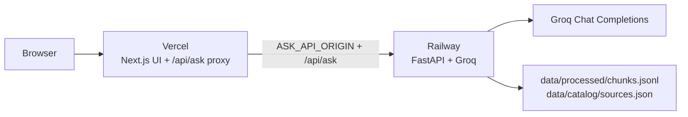

# Deployment Plan: Railway API + Vercel UI

Deploy the FastAPI Ask service to **Railway** and the Next.js UI to **Vercel**. Do this after Phase 6 works locally. Do not change product behaviour (facts-only, Groww citations, no PII).

**Target**

| Layer | Platform | Runtime | Public URL role |
| --- | --- | --- | --- |
| FastAPI (`POST /api/ask`, `GET /health`) | Railway | Python 3.11+, long-running Uvicorn | Upstream API only |
| Next.js 16 App Router (`web/`) | Vercel | Node serverless / Fluid | User-facing site |

The browser never calls Railway. `web/lib/ask.ts` posts to same-origin `/api/ask`. `web/app/api/ask/route.ts` proxies to `ASK_API_ORIGIN` (today `http://127.0.0.1:8000`).



---

## How to use this plan

| Rule | Meaning |
| --- | --- |
| Sequential | Finish **code changes**, then **GitHub**, then **Railway**, then **Vercel** |
| API first | Do not point Vercel at a missing or localhost origin |
| Secrets stay off git | `GROQ_API_KEY` only in Railway Variables. Never on Vercel. Never in `.env` commits |
| Corpus ships with the API | Railway must have `data/processed/chunks.jsonl` and `data/catalog/sources.json` on disk |

---

## 1. What works today vs what production needs

| Item | Local today | Production requirement |
| --- | --- | --- |
| Start API | `python -m app` → Uvicorn `127.0.0.1:8000` | Bind `0.0.0.0` and Railway `$PORT` |
| Python deps | `pyproject.toml` (no `[build-system]`, no `requirements.txt`) | Install **dependencies only** from `requirements.txt`; run from repo root so `project_root()` still finds `data/` |
| UI → API | Next proxy default `http://127.0.0.1:8000` | Vercel env `ASK_API_ORIGIN=https://<railway-host>` (no trailing slash) |
| CORS | Allows `localhost:3000` only | Leave as-is. Production traffic is Vercel server → Railway, not the browser |
| Git | This folder is **not** a git repo yet | GitHub remote required by Railway and Vercel |
| Health | `GET /health` → `{ "status": "ok" }` | Use as Railway healthcheck |
| LLM wait | No timeout on local Next | Set `maxDuration` on `web/app/api/ask/route.ts` (Hobby allows up to 300s) |

`app/corpus/catalog.py` resolves the repo root as two parents above that file. If Railway does `pip install .` and Uvicorn imports `app` from `site-packages`, `data/` will not be found. **Install deps from `requirements.txt` and run Uvicorn against the copied source tree.**

---

## 2. Prerequisites

Accounts and keys (create before clicking Deploy):

- [ ] GitHub account and a **private** repo (corpus HTML is public Groww snapshots; Groq key must not leak)
- [ ] [Railway](https://railway.com/) account (Hobby is enough for one Python service)
- [ ] [Vercel](https://vercel.com/) account (Hobby is enough for this UI)
- [ ] Groq API key from [Groq Console](https://console.groq.com/)
- [ ] Local proof: `python -m app` and `npm run dev` in `web/` still answer a scheme question

Allowed models (from `app/pipeline/config.py`): `openai/gpt-oss-120b` (default) or `openai/gpt-oss-20b`. Do **not** set Compound or Llama IDs.

---

## 3. Code changes before first deploy

Do these in the repo. Do not deploy until this section’s exit criteria pass.

### 3.1 Add `requirements.txt` (Railway install)

Mirror runtime deps from `pyproject.toml`. Do not add pytest/httpx.

```
groq>=0.18.0
python-dotenv>=1.0.1
fastapi>=0.115.0
uvicorn[standard]>=0.32.0
```

### 3.2 Add `.python-version`

```
3.12
```

(3.11 is also valid; `requires-python` is `>=3.11`.)

### 3.3 Add `railway.toml` at repo root

Do **not** use `python -m app` on Railway: `__main__.py` binds localhost port 8000.

```toml
[build]
builder = "NIXPACKS"

[deploy]
startCommand = "uvicorn app.api:app --host 0.0.0.0 --port $PORT"
healthcheckPath = "/health"
healthcheckTimeout = 30
restartPolicyType = "ON_FAILURE"
```

Optional but recommended — ignore `web/` so frontend-only commits do not rebuild the API. Add `railway.json` (or the equivalent Watch Paths in the Railway dashboard):

```json
{
  "$schema": "https://railway.com/railway.schema.json",
  "build": {
    "watchPatterns": [
      "app/**",
      "data/catalog/**",
      "data/processed/**",
      "pyproject.toml",
      "requirements.txt",
      "railway.toml"
    ]
  }
}
```

If both `railway.toml` and `railway.json` exist, keep start/healthcheck in one file and watch paths in the other, or put everything in `railway.json` so there is a single source of truth.

### 3.4 Next.js proxy duration

In `web/app/api/ask/route.ts`, next to `export const dynamic = "force-dynamic"`, add:

```ts
export const maxDuration = 60;
```

The proxy waits on Groq. Sixty seconds is enough for this pipeline; raise toward 300 only if production logs show timeouts.

### 3.5 Confirm corpus is tracked

These paths must be in git (they are not gitignored today):

- `data/catalog/sources.json`
- `data/processed/chunks.jsonl`

Do **not** commit `data/index/` (already ignored) or `.env`.

### 3.6 Optional local-only bind

Keep `python -m app` on `127.0.0.1:8000` for local use. Production uses the Railway `startCommand` in §3.3.

### Exit criteria (code)

- [ ] `requirements.txt` and `.python-version` exist
- [ ] Railway start command uses `0.0.0.0` and `$PORT`
- [ ] `maxDuration` is set on the Ask route
- [ ] `chunks.jsonl` and `sources.json` will be pushed
- [ ] `.gitignore` still lists `.env`

---

## 4. GitHub

Railway and Vercel deploy from GitHub. This workspace currently has **no** `.git` directory.

1. `git init` at the repo root (`mutual-fund-faq-assistant`).
2. Confirm `.env` is untracked (`git status`).
3. First commit: app, `web/` (without `node_modules` / `.next`), `data/catalog`, `data/processed`, `docs/`, deploy config.
4. Create a GitHub repo and `git remote add origin …` then push `main`.

Vercel Root Directory will be `web/`. Railway Root Directory stays the **repository root** (Python package `app/` plus `data/`).

---

## 5. Railway — backend

Order: create service → variables → generate domain → confirm `/health` → then Vercel.

### 5.1 Create the service

1. New Project → Deploy from GitHub → this repo.
2. **Root Directory:** `/` (repo root). Not `web/`.
3. Railway should detect Python via `requirements.txt` / Nixpacks.
4. Confirm start command is  
   `uvicorn app.api:app --host 0.0.0.0 --port $PORT`  
   (from `railway.toml` or the service Settings → Deploy).

If Nixpacks tries to build Next.js because it sees `web/package.json`, set the builder to Nixpacks **Python** explicitly, or add `nixpacks.toml`:

```toml
[phases.setup]
nixPkgs = ["python312"]

[start]
cmd = "uvicorn app.api:app --host 0.0.0.0 --port $PORT"
```

### 5.2 Variables (Railway → Variables)

| Name | Required | Value |
| --- | --- | --- |
| `GROQ_API_KEY` | Yes | Groq secret (never log it) |
| `GROQ_MODEL` | No | `openai/gpt-oss-120b` or `openai/gpt-oss-20b` |
| `PORT` | No | Injected by Railway. Do not override |

Do not add `ASK_API_ORIGIN` here. That is a Vercel variable.

### 5.3 Public networking

1. Settings → Networking → Generate domain (e.g. `https://mutual-fund-faq-api.up.railway.app`).
2. Copy the origin **without** a trailing slash.
3. Smoke test (replace the host):

```bash
curl -sS https://<railway-host>/health
```

Expect `{"status":"ok"}`.

```bash
curl -sS -X POST https://<railway-host>/api/ask \
  -H "Content-Type: application/json" \
  -d "{\"question\":\"What is the expense ratio of HDFC Mid-Cap?\"}"
```

Expect JSON with `type`, `text`, `citation_url`, `disclaimer`. A Groq or empty-index error means env or `data/` is missing — fix before Vercel.

### 5.4 Sleep and restarts

On Hobby, the service may sleep. The first Ask after sleep is slower; Vercel will wait up to `maxDuration`. If demos fail on the first click, turn on a higher Railway plan or send a `/health` ping before the demo.

### Exit criteria (Railway)

- [ ] Deploy is green
- [ ] `GET /health` returns 200
- [ ] `POST /api/ask` returns a contract payload (not a 502 HTML page)
- [ ] Logs show Uvicorn on `0.0.0.0` (not `127.0.0.1`)
- [ ] Logs never print `GROQ_API_KEY`

---

## 6. Vercel — frontend

### 6.1 Import the project

1. Vercel → Add New → Project → the same GitHub repo.
2. **Framework Preset:** Next.js.
3. **Root Directory:** `web` (Edit, then `web`).
4. Build Command: `next build` (default).
5. Output: leave default (not static export). The Ask route is a server handler.

### 6.2 Environment variables (Vercel → Settings → Environment Variables)

| Name | Environments | Value |
| --- | --- | --- |
| `ASK_API_ORIGIN` | Production, Preview, Development | `https://<railway-host>` with **no** trailing slash |

The proxy builds `${ASK_API_ORIGIN}/api/ask`. A trailing slash becomes `https://host//api/ask` and can 404.

Do **not** add `GROQ_API_KEY` on Vercel.

Optional: Ignored Build Step so Python-only commits skip the Next build:

```
git diff --quiet HEAD^ HEAD -- ./web
```

(Vercel skips the build when this command exits `0`.)

### 6.3 Deploy and domain

1. Deploy. Wait for the Production URL (`https://<project>.vercel.app`).
2. Open the UI. History stays in the tab (no user DB). Same PII rules as local.

Preview deployments also need `ASK_API_ORIGIN`. Using the same Railway API for Preview is acceptable for this project.

### Exit criteria (Vercel)

- [ ] Production build succeeds
- [ ] Home page loads (welcome, examples, disclaimer)
- [ ] Example question returns an answer with one Groww citation
- [ ] Browser Network tab shows `POST /api/ask` to the **Vercel** origin, not Railway
- [ ] A nonsense / PII question still refuses (guardrails unchanged)

---

## 7. Environment map

| Variable | Where it lives | Who reads it |
| --- | --- | --- |
| `GROQ_API_KEY` | Railway | Python Groq client |
| `GROQ_MODEL` | Railway (optional) | `resolve_groq_model()` |
| `PORT` | Railway (injected) | Uvicorn |
| `ASK_API_ORIGIN` | Vercel | `web/app/api/ask/route.ts` |

Local `.env` stays on the laptop. It is not used in production.

---

## 8. Verification checklist (end to end)

Run against **production URLs**, not localhost.

1. `curl` Railway `/health`.
2. `curl` Railway `POST /api/ask` with a scheme fact question.
3. Open the Vercel URL.
4. Click each of the three example questions.
5. Ask an out-of-scope / advice question; confirm refusal template.
6. Ask a PII-shaped question; confirm no data is stored and the refuse path runs.
7. Confirm footer / citation still point at `groww.in`.
8. Confirm Railway logs have the request and no secrets.

If the UI shows “temporarily unavailable”, the proxy could not reach Railway (`ASK_API_ORIGIN` wrong, API asleep and timed out, or API crashed). Check Vercel function logs, then Railway logs.

---

## 9. Failure modes

| Symptom | Likely cause | Fix |
| --- | --- | --- |
| Railway deploy never listens | Start still uses `python -m app` / `127.0.0.1` | Start command in §3.3 |
| `/health` 404 | Root Directory set to `web/` | Set Railway root to repo root |
| Ask returns empty-index / catalog error | `data/` missing or `pip install .` shadowed `app` | `requirements.txt` only; confirm files in the image |
| Vercel UI always 502 unavailable | `ASK_API_ORIGIN` missing, trailing slash, or `http://` | HTTPS origin, no slash |
| Vercel timeout | Groq + cold Railway > `maxDuration` | Raise `maxDuration`; ping `/health` first |
| CORS error in the browser | UI calling Railway directly | Keep using `/api/ask` on Vercel; do not change `ask.ts` to a Railway URL |
| Groq 401 / forbidden model | Bad key or `GROQ_MODEL` not in allowlist | Railway Variables; allowed IDs only |
| Railway builds Node | Nixpacks saw `web/package.json` | `nixpacks.toml` / Python-only start (see §5.1) |

---

## 10. Out of scope for this deploy

- Custom domains and HTTPS certs beyond platform defaults
- Auth, rate limiting at the edge, or hiding the Railway URL (the UI does not expose it; the URL is still guessable — acceptable for a course demo)
- CI (GitHub Actions) — optional later: `pytest` on `app/` and `npm run build` in `web/`
- Re-ingest / live crawl of Groww
- Putting both services on one platform

---

## 11. Suggested execution order

1. Land §3 files and `maxDuration`.
2. Init git, push to GitHub (no `.env`).
3. Railway: service, variables, domain, `/health` + `/api/ask`.
4. Vercel: Root Directory `web`, `ASK_API_ORIGIN`, deploy.
5. Run §8 on production URLs.
6. Only then share the Vercel link.

When this plan is executed, implement the config files in §3 first, then connect the two platforms. Do not invent a second API path; keep the existing same-origin proxy.
