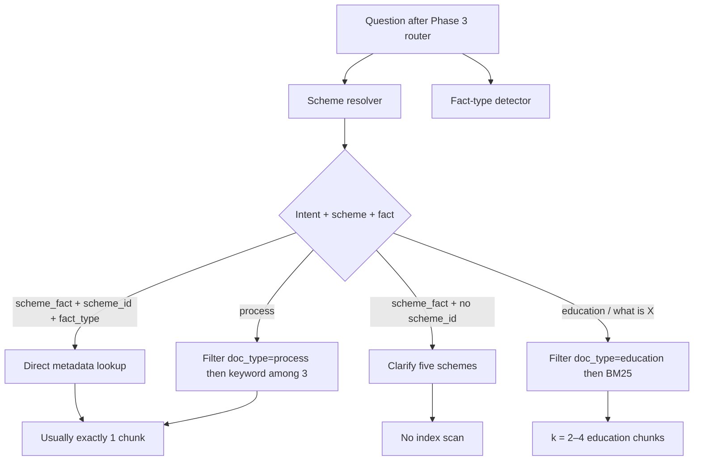

# Implementation Plan: Mutual Fund FAQ Assistant

Phase-wise build plan derived from [`docs/problemStatement.md`](./problemStatement.md) and [`docs/Architecture.md`](./Architecture.md).

**Rule for every phase:** do not ship an unconstrained chatbot and “add RAG later.” Catalog, retrieval, and guardrails are the product. Accuracy over intelligence.

---

## How to use this plan

| Rule | Meaning |
| --- | --- |
| Sequential | A phase starts only when the previous phase’s **exit criteria** are met |
| Test before UI | Retrieval and refusals must work from tests/CLI before any chat screen |
| Official sources only | **Groww (`groww.in`)** scheme URLs from the problem statement — never HDFC AMC, AMFI, SEBI, Value Research, Morningstar, or blogs |
| Definition of done (product) | All five success criteria in problem statement §9 |

**Stack** (from architecture §8, retrieval refined by `data/processed/chunks.jsonl`): Python 3.11+, Streamlit **or** FastAPI + static page, **metadata-first lookup** over 44 Groww chunks, optional local MiniLM/BM25 **only for education paraphrases**, **Groq** Chat Completions (`openai/gpt-oss-20b`, optional `openai/gpt-oss-120b`) at temperature 0, `GROQ_API_KEY` in `.env` only. Do not use Groq Compound (web search).

---

## Phase overview


Phases 3 and 4 can overlap **after** Phase 2.3 `chunks.jsonl` exists (templates do not need chunks; retrieval does). Do not start P5 until both P3 and P4 pass.

| Phase | Outcome | Maps to |
| --- | --- | --- |
| 0 Foundations | Runnable repo, ignore secrets, empty data layout | Architecture §8 module map |
| 1 Corpus | Five Groww scheme HTML snapshots + `sources.json` (`groww.in` only) | Problem §5.1, Architecture §5.2–5.4, §11 |
| 2 Ingest | Chunks + local index + ingest CLI | Architecture §5.2–5.3, order step 2 |
| 3 Guardrails | PII, intent router, refuse / factsheet / not-found templates | Problem §5.3, §6.2–6.3; Architecture §4.2–4.3, §6 |
| 4 Retrieval | Scheme resolver + metadata lookup (hybrid only for education), tested without Groq | Architecture §5.5, order step 3 |
| 5 Answer path | Orchestrator, Groq JSON generation, hard validator, `POST /api/ask` | Problem §5.2; Architecture §4.1, §4.4–4.5, §5.6 |
| 6 UI | Welcome, 3 examples, disclaimer, citation + footer | Problem §5.4, §8.2; Architecture §7 |
| 7 Eval and docs | Golden set, README, known limitations | Problem §8–9; Architecture §13, §15 |

---

## Phase 0 — Foundations

**Goal:** A clone-and-run skeleton with no user data store and no secrets in git.

### Tasks

1. Create the repository layout from architecture §8:

   ```
   app/
     ui.py
     api.py
     pipeline/
     corpus/
   data/
     raw/
     processed/
     catalog/
     index/
   tests/
   docs/          # already present
   ```

2. Add Python 3.11+ project files: `requirements.txt` (or `pyproject.toml`) including `groq` and `python-dotenv`. `.gitignore` (`/.env`, `data/index/`, `__pycache__/`, virtualenv).
3. Add `.env.example` (never commit `.env`):

   ```
   GROQ_API_KEY=
   GROQ_MODEL=openai/gpt-oss-20b
   ```

   Key from [Groq Console](https://console.groq.com/). Optional override: `openai/gpt-oss-120b`. **Do not** set Compound model IDs.
4. Add a stub `POST /api/ask` **or** a stub Streamlit page that returns a static “not wired” message — optional; do not call Groq until Phase 5.
5. Confirm logging policy: **do not log raw questions** (architecture §10). Never log `GROQ_API_KEY`.

### Exit criteria

- [ ] Layout matches the architecture module map
- [ ] Secrets cannot be committed accidentally
- [ ] No PAN/email/phone forms exist
- [ ] App starts locally (even if it cannot answer yet)

**Not in this phase:** embeddings, UI polish, Groq completions.

---

## Phase 1 — Corpus and source catalog

**Goal:** Snapshot the **five Groww scheme URLs** from the problem statement into `data/raw/` and write `sources.json`. This catalog is the citation allowlist and the footer clock. **Do not** download HDFC AMC, AMFI, or SEBI pages.

### Schemes (must all be covered)

| `scheme_id` | Scheme | Category | Groww source URL |
| --- | --- | --- | --- |
| `hdfc-mid-cap-direct-growth` | HDFC Mid Cap Fund — Direct Growth | Mid-cap | https://groww.in/mutual-funds/hdfc-mid-cap-fund-direct-growth |
| `hdfc-small-cap-direct-growth` | HDFC Small Cap Fund — Direct Growth | Small-cap | https://groww.in/mutual-funds/hdfc-small-cap-fund-direct-growth |
| `hdfc-gold-etf-fof-direct-growth` | HDFC Gold ETF Fund of Fund — Direct Plan Growth | Gold ETF FoF | https://groww.in/mutual-funds/hdfc-gold-etf-fund-of-fund-direct-plan-growth |
| `hdfc-large-cap-direct-growth` | HDFC Large Cap Fund — Direct Growth | Large-cap | https://groww.in/mutual-funds/hdfc-large-cap-fund-direct-growth |
| `hdfc-elss-tax-saver-direct-growth` | HDFC ELSS Tax Saver Fund — Direct Plan Growth | ELSS | https://groww.in/mutual-funds/hdfc-elss-tax-saver-fund-direct-plan-growth |

These Groww URLs **are** the corpus (architecture §5.2). Save the HTML snapshots into `data/raw/`.

### Tasks

1. Manually snapshot each of the five Groww URLs into `data/raw/` (one HTML file per scheme). Capture sections used for: TER, exit load, min SIP, riskometer, benchmark, ELSS lock-in (ELSS page).
2. Optionally add **same-host** Groww pages only (`groww.in`) for:
   - Mutual-fund education (refusal citation)
   - Statement / capital-gains download **process** (Groww help)
3. Write `data/catalog/sources.json`:
   - Per-scheme `source_url` (the Groww URL above) and `as_of`
   - `education[]` and `process[]` entries with `groww.in` URLs and `as_of`
   - `publisher` only `groww`; `host_allowlist`: `groww.in`
4. Document `retrieved_on` for each snapshot. Footer dates use page `as_of`, not generation time.
5. Coverage checklist — each fact type exists on the Groww snapshots:

   | Fact type | Required coverage |
   | --- | --- |
   | Expense ratio / TER | All five scheme pages |
   | Exit load | All five |
   | Minimum SIP | All five |
   | ELSS lock-in | ELSS Groww page |
   | Riskometer | All five |
   | Benchmark | All five |
   | Statements / capital gains **process** | Groww help page if catalogued; else not-found still cites `groww.in` |

### Exit criteria

- [ ] Five Groww HTML snapshots on disk (not AMC PDFs)
- [ ] Every catalog URL is `https://groww.in/...`
- [ ] ELSS lock-in and gold FoF pages are present
- [ ] Process + education links, if any, are `groww.in` — not AMFI/SEBI/AMC

**Not in this phase:** chunking, embeddings, answering questions.

---

## Phase 2 — Ingest pipeline and index

**Goal:** Deterministic CLI that turns `data/raw/` into `chunks.jsonl` (and optionally a local vector index for education). Re-ingest is batch, not a runtime crawl.

### 2.1 Source identification and acquisition

Identify every ingestible page from `data/catalog/sources.json` and verify (or batch-fetch) the local HTML under `data/raw/`. Do **not** extract, chunk, or embed yet.

1. Implement `app/corpus/catalog.py`:
   - Load `sources.json`
   - Allow only `publisher=groww` and host `groww.in`
   - Emit one `SourceRecord` per scheme / education / process entry
2. Implement `app/corpus/acquire.py`:
   - Confirm each `local_path` exists under `data/raw/` and is non-empty HTML
   - Optional `--fetch-missing` downloads **only** catalogued `https://groww.in/...` URLs (batch CLI, never per question)
   - Reject AMC / AMFI / SEBI / other hosts
   - Write `data/processed/acquisition-manifest.json`
3. CLI: `python -m app.corpus.acquire` (also `python -m app.corpus.ingest` until later ingest steps exist)

**2.1 exit criteria**

- [ ] Catalog identifies all five schemes plus catalogued education/process pages
- [ ] Manifest status is `present` (or `fetched`) for every identified source
- [ ] Non-Groww URLs/publishers are rejected before any download
- [ ] No chunking, embeddings, or Groq calls

---

### 2.2 Parsing and normalization

Turn acquired Groww HTML into clean, structured documents. Do **not** chunk or embed yet.

1. Implement `app/corpus/html_text.py` and `app/corpus/parse.py`:
   - Extract text from Groww HTML (scheme facts from `__NEXT_DATA__` / `mfServerSideData`)
   - Strip nav/footer/cookie/CTA chrome
   - Drop non-Groww URLs (AMC, AMFI, SEBI, etc.) from extracted text
   - Normalize whitespace and lock-in / TER / SIP / riskometer / benchmark fields
   - Do not copy peer comparisons or return tables into the normalized body
2. Write `data/processed/parsed/<source_id>.json` plus `data/processed/parsed-manifest.json`
3. CLI: `python -m app.corpus.parse` or `python -m app.corpus.ingest` (runs 2.1 then 2.2)

**2.2 exit criteria**

- [ ] Each of the five schemes has normalized expense ratio, exit load, min SIP, riskometer, benchmark
- [ ] ELSS lock-in is present as a normalized fact (3 years on current snapshot)
- [ ] Gold FoF `scheme_id` / URL stay distinct from equity schemes
- [ ] Parsed `source_url` values are `https://groww.in/...` only
- [ ] No chunking, vector index, or Groq calls

---

### 2.3 Chunking strategy (from `data/processed`)

Chunk **parsed JSON**, not raw HTML. The 2.2 parser already extracted facts and (for schemes) pre-split them; 2.3 must not undo that by sliding a token window across the joined `text` field.

| Input | Role |
| --- | --- |
| `data/processed/parsed/<source_id>.json` | Normalized body, `sections[]`, `facts`, `scheme_id`, `source_url`, `as_of` |
| `data/processed/parsed-manifest.json` | Inventory of the 10 documents and `text_chars` |
| `data/catalog/sources.json` | Citation allowlist (must match `source_url`) |

Observed shape after Phase 2.2 (parse date `2026-08-23`):

| `doc_type` | Count | `text_chars` | Existing `sections[]` |
| --- | --- | --- | --- |
| `scheme_page` | 5 | 261–273 | One short section per fact: Expense ratio, Exit load, Minimum SIP, Riskometer, Benchmark, Lock-in (**ELSS only**), Investment objective |
| `process` | 3 | 174 / 714 / 671 | Single “Process” section (`capital_gains`, `statement`, `elss_statement`) |
| `education` | 2 | **18,386** (`groww-types-of-mutual-funds`) vs **18** (`groww-mutual-funds-hub`) | One giant “Education” blob each |

Do **not** apply a global 400–800 token window with overlap to scheme or process docs. Those bodies are already far smaller than one window; a window would glue TER to exit load and break `fact_types` filters.

**Skip floor:** if `parsed-manifest.json` `text_chars` is under 50, emit no chunks for that `source_id`.

**Rules by `doc_type`**

1. **`scheme_page` — one chunk per `sections[]` item (no overlap)**  
   - Read `sections[]` only. Do **not** chunk the concatenated `text` field.  
   - `chunk_id`: `{scheme_id}--{fact_type}` (investment objective: `{scheme_id}--objective`).  
   - Copy that section’s `fact_types` onto the chunk (`expense_ratio`, `exit_load`, `sip`, `riskometer`, `benchmark`, `lockin`). Objective sections have `fact_types: []`.  
   - Metadata on every chunk: `scheme_id`, `scheme_name`, `category` (from parse: `mid-cap` / `small-cap` / `large-cap` / `gold-etf-fof` / `elss`), `plan=direct`, `option=growth`, `doc_type=scheme_page`, `publisher=groww`, that scheme’s Groww `source_url`, `as_of`, `retrieved_on`, `source_title` = parsed `title`.  
   - Gold FoF stays `hdfc-gold-etf-fof-direct-growth` and `https://groww.in/mutual-funds/hdfc-gold-etf-fund-of-fund-direct-plan-growth` — never share a chunk with equity schemes.  
   - ELSS lock-in is its own section (`Lock-in: 3 years` on this snapshot) → chunk `{scheme_id}--lockin`. Other schemes have `facts.lock_in` null and **no** Lock-in section — do not invent empty lock-in chunks.  
   - Expected yield: 6 sections × 4 non-ELSS schemes + 7 ELSS = **31** scheme chunks.

2. **`process` — one chunk per document (no split, no overlap)**  
   - Use the single “Process” section. Capital-gains help is thin chrome (title + Groww URL); **keep it** so the help URL is retrievable.  
   - Optional cleanup: drop repeated chrome lines (`Customer Support`, `Help and Support`, `REPORTS`, `CONTACT US`) if the remaining steps and Groww URL stay intact. Do not strip the “password is your PAN” note — it is Groww help wording; Phase 3 still must not collect PAN from the user.  
   - `chunk_id`: `{source_id}--process`. `scheme_id` is `null`. `fact_types` as parsed (`process` plus `capital_gains` / `statement` / `elss_statement`).  
   - Expected yield: **3** process chunks.

3. **`education` — heading split on the glossary; skip the empty hub**  
   - **Skip** `groww-mutual-funds-hub` (`text_chars` 18, text `"Groww Mutual Funds"`).  
   - Split `groww-types-of-mutual-funds.json` **`text`** (the one `sections[]` item is not useful).  
   - **Do not split on the first bare headings** `Equity Schemes` / `Debt Schemes` / … — those appear first as a 5-line TOC under `Based on Principal Investments` (~474 characters). Using them would dump ~10k characters into one “Other Schemes” blob.  
   - Split on these **body** markers (second occurrence / hyphen prefix), in document order:

     | Marker in `text` | Role on this snapshot | Approx. size |
     | --- | --- | --- |
     | Start of file → before `Schemes Based on the Maturity Period` | Intro | ~1.5k chars (~365 tokens) |
     | `Schemes Based on the Maturity Period` | Open / close / interval | ~1.7k chars (~434 tokens) |
     | `Based on Principal Investments` → before `- Equity Schemes` | Short TOC; keep as one small chunk or merge into intro | ~0.5k chars |
     | `- Equity Schemes` | SEBI equity categories (includes Large / Mid / Small / ELSS) | ~3.2k chars (~800 tokens) |
     | `- Debt Schemes` | SEBI debt categories | ~3.6k chars (~894 tokens) |
     | `- Hybrid Schemes` | Hybrid categories | ~2.3k chars (~563 tokens) |
     | `- Solution Oriented Schemes` | Retirement / children’s | ~0.5k chars |
     | `- Other Schemes` → before `Asset Management Company` | Index / ETF / FoF only | ~0.4k chars |

   - **Drop** from `Asset Management Company` through `Mirae Asset Mutual Fund` (AMC name dump, ~1k chars).  
   - **Drop** advisory FAQ blocks so refusals cannot retrieve them: `What type of mutual fund is best?`, `How do I start a mutual fund?`, `Which type of mutual fund is safest?`, `Which mutual fund is good for 5 years?`.  
   - **Keep** `How many types of funds are there?` if the answer stays definitional (category counts), not “best fund”.  
   - Token cap applies **only** here: if a heading block is still **&gt; ~800 tokens** (debt is, on this snapshot), pack paragraphs with **no overlap**. Use ~400-token slices with **40-token overlap** only if a single paragraph exceeds the cap. Equity is ~800 tokens — one chunk is enough; optional extra split on `Large Cap Funds` / `Mid Cap Funds` / `Small Cap Funds` / `ELSS Funds` is allowed so category questions retrieve a tight passage.  
   - `scheme_id` is `null`. `fact_types`: `["education"]`. `source_url`: `https://groww.in/p/types-of-mutual-funds`. `chunk_id`: `groww-types-of-mutual-funds--{slug}` (e.g. `…--equity`, `…--debt`).  
   - Expected yield: **~8–12** education chunks, not one 18k-character blob.

**Expected `chunks.jsonl` size (this snapshot):** ~31 scheme + 3 process + ~8–12 education ≈ **42–46** rows. That is the whole index; do not pad with overlapping scheme windows.

**Do not chunk**

- Raw `data/raw/**/*.html` (chrome, SID links to hdfcfund.com, peer tables).  
- `groww-mutual-funds-hub` and any other document whose `text_chars` is under 50.  
- Parsed `facts.lock_in_raw` with all-null years (non-ELSS).  
- Return / CAGR / peer-comparison text (already excluded in 2.2; do not reintroduce).  
- Education AMC list and advisory FAQ answers listed above.

**Chunk record (write `data/processed/chunks.jsonl`)**

```json
{
  "chunk_id": "hdfc-large-cap-direct-growth--expense_ratio",
  "scheme_id": "hdfc-large-cap-direct-growth",
  "scheme_name": "HDFC Large Cap Fund — Direct Growth",
  "plan": "direct",
  "option": "growth",
  "category": "large-cap",
  "doc_type": "scheme_page",
  "fact_types": ["expense_ratio"],
  "source_url": "https://groww.in/mutual-funds/hdfc-large-cap-fund-direct-growth",
  "source_title": "HDFC Large Cap Fund — Direct Growth",
  "as_of": "2026-08-21",
  "retrieved_on": "2026-08-23",
  "publisher": "groww",
  "text": "Expense ratio: 1.03"
}
```

CLI: `python -m app.corpus.chunk` reads parsed JSON + manifest and writes `data/processed/chunks.jsonl`.

**2.3 exit criteria (chunking only)**

- [ ] Scheme chunks are 1:1 with parsed `sections[]`; a TER chunk’s `text` does not contain exit-load or SIP lines  
- [ ] ELSS has a `lockin` chunk; the other four schemes do not  
- [ ] Gold FoF chunks use only `hdfc-gold-etf-fof-direct-growth` and the gold Groww URL  
- [ ] Process chunks have `scheme_id` null and `doc_type=process`  
- [ ] `groww-mutual-funds-hub` is absent from `chunks.jsonl`  
- [ ] Glossary is heading-split (hyphen body markers, not the TOC); AMC list and advisory FAQs are absent  
- [ ] Every `source_url` is in `sources.json` (`groww.in` only)

---

### 2.4 Embed and index

After 2.3 `chunks.jsonl` exists. **Optional for v1.** Phase 4 scheme-fact and process answers look up JSONL by metadata and do not need vectors.

1. If built: embed with **local** MiniLM (`sentence-transformers`); do not use Groq for embeddings  
2. Persist Chroma **or** FAISS under `data/index/` with metadata (`scheme_id`, `doc_type`, `fact_types`)  
3. Use this index **only** as a secondary lane for paraphrased **education** questions after `doc_type=education` is applied  
4. Never run unfiltered dense k-NN across all 44 chunks — TER/SIP/riskometer strings collide across schemes (see Phase 4)  
5. CLI: `python -m app.corpus.ingest` runs 2.1 → 2.2 → 2.3 (→ 2.4 if embeddings are enabled)

### 2.5 Scheduled re-ingest

Acquire (`--fetch-missing`) leaves an existing snapshot alone, so it cannot keep the corpus current. Add a separate refresh stage that **re-fetches** every catalogued `groww.in` URL.

1. Implement `app/corpus/refresh.py`:
   - Fetch every catalogued source (Groww allowlist only; never per user question)
   - Verify parsed output before writing: scheme pages must keep every fact `sources.json` says they carry; education/process pages must not collapse relative to the last good parse
   - All-or-nothing: one rejected or failed fetch writes nothing and leaves the last good corpus live
   - Rewrite a snapshot only when parsed content changed (HTML churn must not produce a daily diff)
   - On change: update `as_of` / `retrieved_on`, mirrored `facts` / `coverage`, then parse and chunk
2. CLI: `python -m app.corpus.refresh` (also `python -m app.corpus.ingest --refresh`). `--dry-run` fetches and verifies without writing.
3. GitHub Actions `.github/workflows/refresh-corpus.yml`: daily cron at 01:30 UTC plus `workflow_dispatch`. Runs refresh, then pytest, then commits `data/` only when the corpus actually changed.

**2.5 exit criteria**

- [ ] `--dry-run` against the live catalog exits 0 and reports `updated` / `unchanged` / `rejected` per source
- [ ] A page that loses a declared fact (or a fetch that is too small / blocked) does not overwrite snapshots
- [ ] A second refresh of identical content reports `unchanged` and does not bump `as_of`
- [ ] Workflow file exists and does not commit on verification failure

### Phase 2 exit criteria (full ingest)

- [ ] Re-running ingest is idempotent enough to demo (same catalog → `chunks.jsonl`; index if 2.4 is on)  
- [ ] Sample chunks for TER / load / SIP / lock-in / process carry the right `scheme_id` and `fact_types`  
- [ ] Gold FoF chunks cannot be mistaken for equity schemes  
- [ ] No non-Groww URLs appear in chunks or catalog  

**Not in this phase:** Groq generation, UI.

---

## Phase 3 — Guardrails, router, and templates

**Goal:** Advisory, comparison, PII, out-of-scope, and performance questions never reach Groq. Prefer rules over a Groq classifier.

**Depends on:** Phase 0 (code layout). Catalog from Phase 1 is required for Groww education and scheme URLs in templates.

### Tasks

1. **`app/pipeline/pii.py`**
   - Detect PAN, Aadhaar, emails, phones, OTP-like codes, account-like numbers
   - On hit: do not retrieve, generate, or store the question
   - Return safety refusal + one catalog education/safety URL + footer `as_of`
2. **`app/pipeline/router.py`**
   - Intents: `advisory`, `comparison`, `performance`, `process`, `scheme_fact`, `out_of_scope`, `pii`
   - Conservative mix: “what is TER and should I buy?” → `advisory`
3. **`app/pipeline/templates.py`**
   - Advisory / comparison / OOS: polite, facts-only limitation, **one** Groww education URL from the catalog
   - Performance: **no numbers computed**; point to that scheme’s **Groww page** only; if scheme unknown, clarify then link
   - Not-found: fact not in the loaded Groww pages + one catalogued Groww URL
   - All templates: ≤ 3 sentences, exactly one allowlisted `groww.in` URL, footer date from catalog
4. Unit tests for routing and template shape (no Groq call required).

### Exit criteria

- [ ] “Should I invest in this fund?” → `refuse`, education link, no scheme TER in the body
- [ ] “Which fund is better?” → `refuse`
- [ ] “What returns did this fund give last year?” → `factsheet_only`, no calculated returns
- [ ] PII in the question → safety refusal; nothing written under `data/` or logs
- [ ] Other AMC / stocks / crypto → `out_of_scope`

**Not in this phase:** hybrid retrieval quality (stubs OK).

---

## Phase 4 — Scheme resolver and metadata-first retrieval

**Goal:** The right **Groww** passage for scheme facts and process queries, **tested without Groq**.

**Depends on:** Phase 2.3 `data/processed/chunks.jsonl` (44 rows on this snapshot). Phase 2.4 embeddings are **not** required for scheme facts.

This section **supersedes** the generic “dense + BM25 + RRF, k = 4” sketch in Architecture §5.5 for *this* corpus. Hybrid search over unfiltered chunk text will pick the wrong scheme.

### Why hybrid-first fails on `chunks.jsonl`

| Observation (2026-08-23 snapshot) | Retrieval consequence |
| --- | --- |
| **44 chunks total** (31 scheme, 10 education, 3 process) | An in-memory table is enough; a vector DB is optional |
| Scheme bodies are **14–141 characters** (median **23**) | MiniLM cannot distinguish schemes from the fact string alone |
| Scheme **names are not in fact chunk text** (`Expense ratio: 1.03` has no “HDFC” / “large cap”) | BM25 on `text` cannot resolve `scheme_id` — the resolver must |
| **Identical text across schemes:** SIP `100` (4 schemes), riskometer `Very High` (4), TER `0.75` (mid **and** small), exit load `1%` / 1 year (small **and** large) | Dense nearest neighbour **will** mix mid/small TER and gold/equity SIP |
| ELSS lock-in text is only `Lock-in: 3 years` | A query “lock-in ELSS” ranks the **education equity** blob higher on keywords than the lock-in chunk unless `scheme_id` + `lockin` are applied |
| Capital-gains process chunk is **138 characters** (title + Groww URL) | “capital gains” also overlaps scheme **objectives** (“capital appreciation”) unless `doc_type=process` |
| Education chunks are the only long, unique passages (356–3198 chars) | This is the **only** lane where BM25 (and optional dense) earns its keep |

Naive keyword overlap on this file: “expense ratio HDFC large cap” ties **all five** TER chunks; “large cap” hits the large-cap **objective**, not the TER line. Filters are the product.



### Query understanding (no Groq)

1. **`app/pipeline/scheme_resolver.py`**
   - Alias map from catalog `scheme_name` / `category` (not from chunk `text`): “HDFC large cap”, “large cap fund”, “mid cap”, “small cap”, “gold”, “gold ETF”, “FoF”, “ELSS”, “tax saver”, legal names, light misspellings (`lrg cap`)
   - Bare “HDFC” or “the fund” matches all five → **clarify**, never guess
   - SCH-07: Balanced Advantage / other AMCs → out of scope (Phase 3), not nearest-neighbour large-cap
   - If the fact is scheme-specific and no scheme matches → one clarification listing the five in-scope Direct Growth schemes (≤ 3 sentences). Do not search TER chunks
2. **`app/pipeline/fact_type.py`** (rules, not an LLM)

   | Detected `fact_types` | Question cues |
   | --- | --- |
   | `expense_ratio` | expense ratio, TER, total expense |
   | `exit_load` | exit load, redemption load |
   | `sip` | SIP, minimum SIP, min investment, minimum amount |
   | `riskometer` | riskometer, risk level, how risky |
   | `benchmark` | benchmark |
   | `lockin` | lock-in, lock in |
   | `objective` | investment objective, what does it invest in, what does the scheme seek |
   | `capital_gains` | capital gain(s) report |
   | `statement` | transaction history, order history, account statement |
   | `elss_statement` | ELSS statement, tax statement (download / report) |
   | `education` | what is a large/mid/small cap, what is ELSS, types of funds, FoF / index |

### Retrieval lanes (`app/pipeline/retrieve.py`)

Load `data/processed/chunks.jsonl` into memory. **Do not** embed-then-search the whole file.

**Lane A — scheme fact, scheme + fact type known (golden TER/load/SIP/lock-in/risk/benchmark)**  
Hard-filter `scheme_id` (and `plan=direct` if the user said Direct). Then require `fact_types` to contain the detected type; for objective use `chunk_id` ending `--objective` (`fact_types` is `[]`).  
On this snapshot that is **exactly one chunk**. Return it (`k = 1`). No BM25, no dense, no RRF.  
Empty filter (e.g. lock-in on mid-cap) → **not-found** for that scheme. Do **not** widen to ELSS `--lockin` or education “lock-in” prose.

**Lane B — scheme known, fact type unknown** (“tell me about HDFC large cap”)  
Filter `scheme_id` only. Return that scheme’s 6 or 7 tiny chunks (all share one Groww URL). Still one citation.

**Lane C — scheme-specific fact, scheme unknown**  
No corpus scan. Clarification only (SCH-01).

**Lane D — process**  
Hard-filter `doc_type=process` (3 chunks). Then match `capital_gains` / `statement` / `elss_statement` from the detector, else BM25 **inside those three**.  
Do not mix scheme TER or objectives. Capital-gains is title + URL only — rank on `chunk_id` / title / URL tokens, not cosine vs “capital appreciation”.  
Reply path must not ask the user for PAN (chunk text may mention PAN as a **report password**).

**Lane E — education**  
Hard-filter `doc_type=education` (10 chunks; hub is already absent). Then **BM25** (prefer exact headings: Large Cap, Mid Cap, Small Cap, ELSS, FoF). Optional dense **after** this filter for paraphrases. `k = 2–4`.  
“What is ELSS?” must not retrieve `groww-elss-tax-statement--process`. “Download ELSS statement” stays in lane D.

**Do not**

- Unfiltered dense k-NN or global BM25 over all 44 rows  
- Boost-only `fact_types` without `scheme_id` on scheme facts (all five TER chunks would tie)  
- Treat gold FoF as an equity neighbour  
- Average or blend colliding strings (`0.75` is mid **and** small — only `scheme_id` tells them apart)

**Citation picker:** the single returned chunk’s `source_url` (already in `sources.json`). Scheme facts and performance-link → that scheme’s Groww page; process → that help URL; education → `https://groww.in/p/types-of-mutual-funds`. One URL.

**Not-found / low confidence:** empty metadata lookup, or education BM25 with no term overlap. Distinguishable so Phase 5 can emit the not-found template. Do **not** use a global similarity floor as the scheme-fact not-found signal.

### Tests (architecture §13 / eval §6, no Groq)

- One question per fact type × five schemes: top chunk `scheme_id` + `fact_types` + Groww URL  
- Mid vs small TER both `0.75` → still the asked `scheme_id`  
- Gold exit load (15 days) vs equity 1-year load  
- ELSS lock-in vs mid-cap lock-in not-found  
- Process capital-gains does not return `--expense_ratio`  
- “What is a large cap fund” → education `--equity`, not large-cap TER  

### Exit criteria

- [ ] Large-cap TER lookup returns `hdfc-large-cap-direct-growth--expense_ratio` only — not gold or small-cap  
- [ ] Mid-cap TER is `0.75` **and** `hdfc-mid-cap-direct-growth`; small-cap TER is the other `0.75` chunk  
- [ ] ELSS lock-in retrieves `…--lockin`; mid-cap lock-in does not copy `3 years`  
- [ ] Process query does not return expense-ratio chunks  
- [ ] Education “what is ELSS” does not return the ELSS tax-statement process chunk  
- [ ] Empty/unknown scheme or empty filter is distinguishable so Phase 5 can emit not-found / clarify  
- [ ] Citation candidate URL is always in `sources.json`

**Not in this phase:** Groq wording.

---

## Phase 5 — Orchestrator, generation, validator, Ask API

**Goal:** End-to-end **facts-only** answers that meet the response contract. **Groq** formats retrieved facts; it does not choose URLs or dates.

**Depends on:** Phases 3 and 4.

### Tasks

1. **`app/pipeline/generate.py`** — Groq only (architecture §5.6)
   - `from groq import Groq`; client reads `GROQ_API_KEY`
   - Default `GROQ_MODEL=openai/gpt-oss-20b`; allow `openai/gpt-oss-120b`
   - **Forbidden model IDs:** `groq/compound`, `groq/compound-mini` (web search)
   - `temperature=0`, `max_completion_tokens=256`, excerpts-only prompt
   - Structured outputs / JSON object: `{ "sentences": [...], "used_chunk_id": "..." }`
   - Instructions: max 3 sentences; no advice/comparisons/return math; no invented numbers; no non-Groww sites; insufficient excerpts → say not in loaded Groww pages
   - Never call Groq if the PII detector fired
   - Honour `openai/gpt-oss-120b` Groq console limits: **30 RPM**, **1K RPD**, **8K TPM**, **200K TPD**. Client-side sliding windows in `app/pipeline/rate_limit.py`; trim trailing excerpts to fit TPM; at most **2s** wait; then skip Groq and use the verbatim-chunk fallback (GROQ-03 / GROQ-09)
2. **`app/pipeline/validate.py`** (hard gate)
   - ≤ 3 sentences
   - Advice lexicon fail (recommend, should invest, better than, buy, sell, outperform, guaranteed, …)
   - Numeric claims must appear in retrieved text
   - Performance intent must not contain computed return percentages
   - **Orchestrator** attaches `citation_url` and `last_updated_from_sources` from chunk/catalog metadata — never from the model
   - URL must be in the allowlist
   - One repair pass; then template fallback (architecture §4.5, §12)
3. **Orchestrator** wiring:
   - PII → template
   - Router → refuse / factsheet_only / RAG / clarify
   - RAG: retrieve → generate → validate → public payload
   - Groq timeout / 429 / 5xx / local quota miss: one bounded retry optional (cap wait at 2s, honour `Retry-After` if shorter); then verbatim quote from top chunk if safe; else error + that scheme’s Groww URL
4. **`POST /api/ask`** contract (architecture §4.1):

   ```json
   {
     "type": "answer | refuse | factsheet_only | error",
     "text": "...",
     "citation_url": "https://...",
     "citation_label": "...",
     "last_updated_from_sources": "YYYY-MM-DD",
     "disclaimer": "Facts-only. No investment advice."
   }
   ```

5. Conflicting chunks: prefer latest `as_of`; never average numbers.

### Exit criteria (CLI or API, no UI required)

- [ ] Factual: “What is the expense ratio of HDFC Large Cap Fund Direct Growth?” → ≤ 3 sentences, **exactly one** Groww link (`hdfc-large-cap-fund-direct-growth`), footer date = cited page `as_of`
- [ ] Advisory and comparison still `refuse` with Groww education link (RAG not used)
- [ ] Performance still `factsheet_only` citing the scheme’s Groww URL
- [ ] Process: statements / capital gains — Groww help/process, no request for PAN in the API
- [ ] Validator rejects hallucinated URLs and advice phrasing
- [ ] No PII fields accepted or stored
- [ ] Missing `GROQ_API_KEY` fails clearly (no crash dump of secrets)
- [ ] `GROQ_MODEL` is never a Compound ID

**Not in this phase:** visual polish (can use curl/httpx).

---

## Phase 6 — Minimal UI

**Goal:** Clean, user-friendly chat that matches problem statement §5.4. Groww is UX reference **and** the citation host.

### Tasks

1. Welcome message: what the assistant is (facts from Groww scheme pages) and is not (no advice).
2. **Three example questions** (click-to-fill), architecture §7:
   - Expense ratio of HDFC Large Cap Fund Direct Growth
   - Exit load on HDFC Mid Cap Fund Direct Growth
   - Lock-in for HDFC ELSS Tax Saver Fund Direct Plan Growth
3. Disclaimer **always visible:** `Facts-only. No investment advice.`
4. Render `text` + **one** source link + `Last updated from sources: <date>`.
5. In-memory thread only; clearing the tab drops history; do not write questions to disk.
6. **Must not include:** sign-in, PAN/folio, statement uploads, return charts, comparison tables, “invest now”, advisory follow-ups.

### Exit criteria

- [ ] Welcome, three examples, disclaimer visible without scrolling off on a normal desktop viewport
- [ ] Example clicks run the same Ask path as typed questions
- [ ] Answer, refuse, and factsheet-only types all show one link + footer
- [ ] No analytics SDK that exfiltrates questions

---

## Phase 7 — Evaluation, README, and release hygiene

**Goal:** Prove success criteria and ship the required README.

### 7.1 Golden-question suite (architecture §13)

Implement as automated tests and/or a checked list. Full protocol: [`docs/eval.md`](./eval.md). Boundary cases: [`docs/edge-case.md`](./edge-case.md).

| Bucket | Minimum cases |
| --- | --- |
| Facts | TER, exit load, min SIP per scheme (all five) |
| ELSS | Lock-in |
| Labels | Riskometer and benchmark for at least two schemes |
| Process | Statement download; capital gains report |
| Refuse | “Should I invest…?”, “Which is better?”, other AMC |
| Performance | Returns last year → that scheme’s Groww page only, no math |
| PII | Question containing PAN/email → safety refuse, no persistence |
| Contract | Every `answer`/`refuse`/`factsheet_only`: ≤ 3 sentences, host **`groww.in`**, URL ∈ `sources.json`, footer present |

Fix retrieval or templates until this suite passes; do not “prompt harder” past validator failures.

### 7.2 README (problem statement §8.1)

Must include:

1. Setup (Python version, venv, create Groq key, `.env` with `GROQ_API_KEY` / `GROQ_MODEL`, ingest CLI, how to run UI)
2. Selected AMC (HDFC) and the five schemes
3. Architecture overview (RAG: ingest Groww snapshots → retrieve → Groq generate → cite `groww.in`; guardrails first)
4. Known limitations (architecture §15): stale until the next successful refresh; five schemes only; Groww wording; no guessing; Groq is a formatter; no Compound/web search; not AMC/AMFI/SEBI originals
5. Disclaimer snippet: `Facts-only. No investment advice.`

### 7.3 Final product checks

- [ ] Accurate retrieval vs Groww snapshots (spot-check numbers by hand against the saved HTML)
- [ ] Facts-only: no opinions, rankings, return math
- [ ] Valid citations on every path
- [ ] Proper refusals
- [ ] UX checklist from Phase 6

### Exit criteria

- [ ] Golden suite green (or documented skips with reason — none expected for the minimum set)
- [ ] README complete
- [ ] Demo path: ingest (if needed) → run UI → three examples + one refusal + one performance question

---

## Cross-cutting constraints (all phases)

| Constraint | Enforcement |
| --- | --- |
| Groww-only sources | Ingest allowlist + citation catalog (`groww.in`) |
| No other websites | Never ingest AMC, AMFI, SEBI, Value Research, Morningstar, or blogs |
| No investment advice | Router + templates + output lexicon |
| No return calculation | `performance` never uses a calculator (there is none) |
| No PII collect/store | No forms; detector; no question logs |
| ≤ 3 sentences, 1 link, last-updated footer | Validator + orchestrator metadata |
| Lightweight | In-memory `chunks.jsonl` lookup; no user DB; vector index optional |
| Groq only for generation | Local embeddings; no Compound; `GROQ_API_KEY` never committed |

---

## Out of scope (do not schedule)

- Personalized suitability or “best fund for me”
- Multi-AMC coverage
- Login, KYC, folio/PAN capture
- Live scrape of Value Research / Morningstar / AMC sites (Groww is batch-snapshotted, not crawled per ask)
- Historical or expected return engines
- Long-form educational essays

---

## Suggested sequencing and checkpoints

| After phase | Demoable checkpoint |
| --- | --- |
| 1 | Folder of Groww HTML snapshots + catalog JSON reviewed |
| 2 | `chunks.jsonl` inspected for TER/load/SIP tags |
| 3 | Router tests: refuse / factsheet_only / PII |
| 4 | Retrieval tests: correct `scheme_id` / `chunk_id` via metadata lookup, without Groq |
| 5 | Groq-backed `POST /api/ask` matches interaction contract (problem §11) |
| 6 | Full UI walkthrough |
| 7 | README + golden suite = project complete |

**Stop-the-line defects** (block the next phase): citation host not `groww.in`; URL missing from catalog; advice in an `answer`; returns computed by the app; PII stored; AMC/AMFI/SEBI used as a source.

---

## Traceability

| Problem / architecture requirement | Phase that implements it |
| --- | --- |
| Corpus: 1 AMC, 5 diverse schemes | 1 |
| Ingest Groww snapshots | 1–2 |
| Retrieve Groww passages | 4 |
| Generate ≤ 3 sentences, 1 citation, footer | 5 (Groq formatter) |
| Refuse advisory / comparison | 3, 5 |
| Performance → factsheet only | 3, 5 |
| PII never collected | 0, 3, 6 |
| Minimal UI + disclaimer | 6 |
| README + limitations | 7 |
| Success criteria | 7 (proven), 4–6 (built) |
